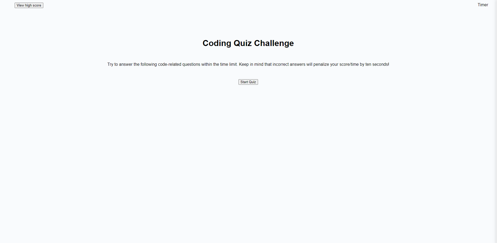

# Web APIs: Code Quiz
Built a timed coding quiz featuring dynamically updated HTML and CSS with JavaScript. Implemented a timer and scoring mechanism, along with handling multiple-choice questions. Stored and displayed high scores, creating a polished user interface.

## Live Web App

https://bcgosselin.github.io/Web-APIs-Code-Quiz/

## Description

This project is Robert Gosselin's fourth web application challenge. This project was created to showcase his skills and aptitude using only text based instructions. This webpage's index, script utilizing jQuery API, and style sheet was written by hand utilizing credited resources [Credits](#credits). The goal of this challenge was to develop and engineer a fuctioning quiz on a live website. Everything included was apart of an ongoing bootcamp to develop and hone Full Stack Web Development skills.

## Table of Contents (Optional)

- [Installation](#installation)
- [Usage](#usage)
- [Credits](#credits)
- [License](#license)

## Installation

NA

## Usage

Feel free to view below screenshot (ctrl + click).

## Credits

Utilized within variable question
    - [https://stackoverflow.com/questions/62594459/how-to-check-the-correct-answer-javascript-4-buttons]

    - [assistance from instructor during office hours]

Utilized within function startTimer
    - [https://www.youtube.com/watch?v=4piMZDO5IOI&ab_channel=ReachStar]

Utilized for variable hideIntro
    - [https://stackoverflow.com/questions/2420135/hide-html-element-by-id]

Utilized for function displayQuestion
    - [https://www.w3schools.com/jquery/jquery_syntax.asp]

Utilized for questionLoop
    - [https://www.w3schools.com/jsref/tryit.asp?filename=tryjsref_document_queryselectorall_class]

Utilized for function displayFinalScore
    - [https://www.w3schools.com/jquery/tryit.asp?filename=tryjquery_event_click_trigger]

    - [https://blog.logrocket.com/localstorage-javascript-complete-guide/#:~:text=of%20a%20localStorage-,Storing%20data%20with%20setItem(),the%20value%20attached%20to%20it]

    - [https://medium.com/@awaisalwaisy/how-to-store-html-form-value-in-an-array-9aedffab7c#:~:text=To%20get%20input%20from%20an,()%20method%20of%20the%20array.&text=You%20can%20add%20as%20many,in%20the%20array%20as%20needed]

Utilized for userInput, .map functions, and JSON.parse

    - [assistance from friend]

## License

MIT License

Copyright (c) [2023] [Robert Gosselin]

Permission is hereby granted, free of charge, to any person obtaining a copy
of this software and associated documentation files (the "Software"), to deal
in the Software without restriction, including without limitation the rights
to use, copy, modify, merge, publish, distribute, sublicense, and/or sell
copies of the Software, and to permit persons to whom the Software is
furnished to do so, subject to the following conditions:

The above copyright notice and this permission notice shall be included in all
copies or substantial portions of the Software.

THE SOFTWARE IS PROVIDED "AS IS", WITHOUT WARRANTY OF ANY KIND, EXPRESS OR
IMPLIED, INCLUDING BUT NOT LIMITED TO THE WARRANTIES OF MERCHANTABILITY,
FITNESS FOR A PARTICULAR PURPOSE AND NONINFRINGEMENT. IN NO EVENT SHALL THE
AUTHORS OR COPYRIGHT HOLDERS BE LIABLE FOR ANY CLAIM, DAMAGES OR OTHER
LIABILITY, WHETHER IN AN ACTION OF CONTRACT, TORT OR OTHERWISE, ARISING FROM,
OUT OF OR IN CONNECTION WITH THE SOFTWARE OR THE USE OR OTHER DEALINGS IN THE
SOFTWARE.
